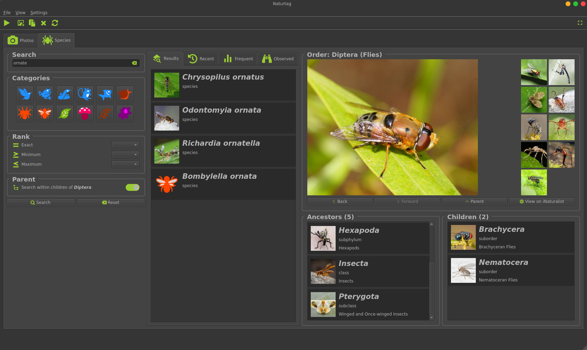
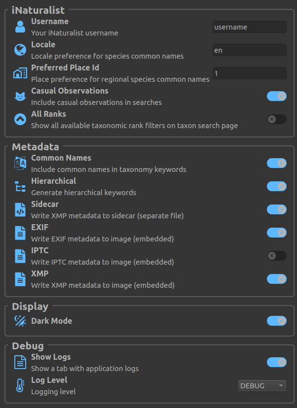

# Application Guide
The main interface for this project will be a desktop application, although it's still a work in
progress. Soon this will be packaged into more convenient platform-specific builds, but for now it
must be installed and launched from the command line.

To launch, run:
```
python -m naturtag.app.app
```

## Image Selection and Tagging
The **Photos** tab is the main interface for selecting and tagging images:


1. Select images:
    * Drag & drop images or folders into the window
    * Or, select files via the file browser (from the toolbar, or `Ctrl+O`)
2. Select iNaturalist metadata:
    * Enter an iNaturalist observation ID or taxon ID
    * Or paste an iNaturalist URLs with `Ctrl+V`
    * Or search for a species from the **Species** tab (see details below)
    * Coming soon: search for observations from the **Observations** tab
3. Click the **Run** (▶️) button in the top right (or `Ctrl+R`) to tag the selected images

Mouse actions:
* **Left-click** an image to view fullscreen
* **Middle-click** an image to remove it
* **Right-click** an image for a context menu with more actions:


## Species Search
The **Species** tab contains tools to search and browse species to tag your images with:


### Basic Search
You can start by searching by name, with autocompletion:


### Full Search
Or you can also run a full search using additional filters:
* **Categories** filters by iconic taxa (Birds, Amphibians, etc.). `Ctrl-click` to select multiple.
* **Rank** filters by taxonomic rank (Family, Genus, Species, etc.).
  * Select an exact rank, for example to search only for species
  * Or select a minimum and/or maximum rank, for example to search for anything between a species
    and a family.
* **Parent** uses the selected taxon as a filter, and searches within children of that taxon. For
  example, to search for flies (_Diptera_) with 'ornate' in the name:



### Navigation
* After selecting a taxon, you will see a list of its **Ancestors** and **Children**
* The **Back** and **Forward** buttons (or `Alt-Left`/`Right`) navigate through recently viewed taxa
* The **Parent** button (or `Alt-Up`) selects the immediate parent
* **View on iNaturalist** will show more details about the taxon on inaturalist.org, in a new browser tab
* Click on a taxon photo or the thumbnails to the right to view fullscreen

### Species Lists
The additional tabs next to search results contain:
* **Recent:** Recently viewed taxa
* **Frequent:** Most frequently viewed taxa
* **Observed:** Taxa observed by you, sorted by observation count


### Settings
See the **Settings** menu for some settings to customize the metadata that your images will be
tagged with, iNaturalist info used in search filters, and other behavior:



## Keyboard Shortcuts
Some keyboard shortcuts are included for convenience:

Key(s)         | Action                    | Tab/Screen
----           |----                       |----------
`Ctrl+O`       | Open file browser         | Photos
`Ctrl+V`       | Paste photos or iNat URLs | Photos
`Ctrl+R`       | Run image tagger          | Photos
`Shift+Ctrl+X` | Clear selected images     | Photos
`F5`           | Refresh photo metadata    | Photos
`Ctrl+Enter`   | Run search                | Species
`Alt+Left`     | View previous taxon       | Species
`Alt+Right`    | View next taxon           | Species
`Alt+Up`       | View parent taxon         | Species
`Left`         | View previous image       | Fullscreen image (local photo or taxon)
`Right`        | View next image           | Fullscreen image (local photo or taxon)
`Escape`       | Exit fullscreen view      | Fullscreen image (local photo or taxon)
`Ctrl+Tab`     | Cycle through tabs        | All
`F11`          | Toggle fullscreen         | All
`Ctrl+Q`       | Quit                      | All
